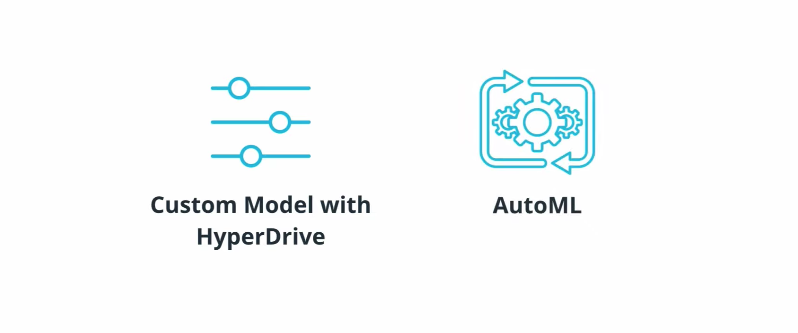
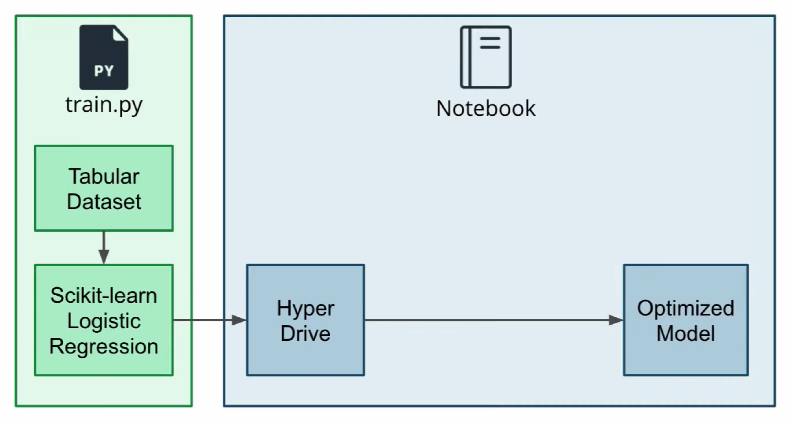
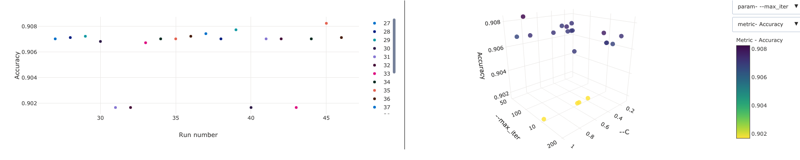
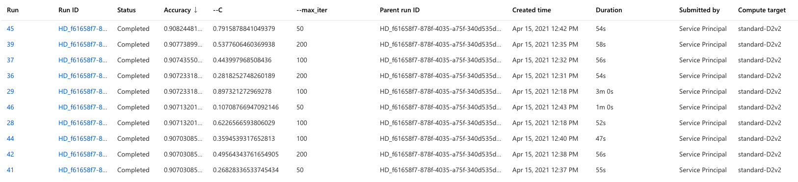
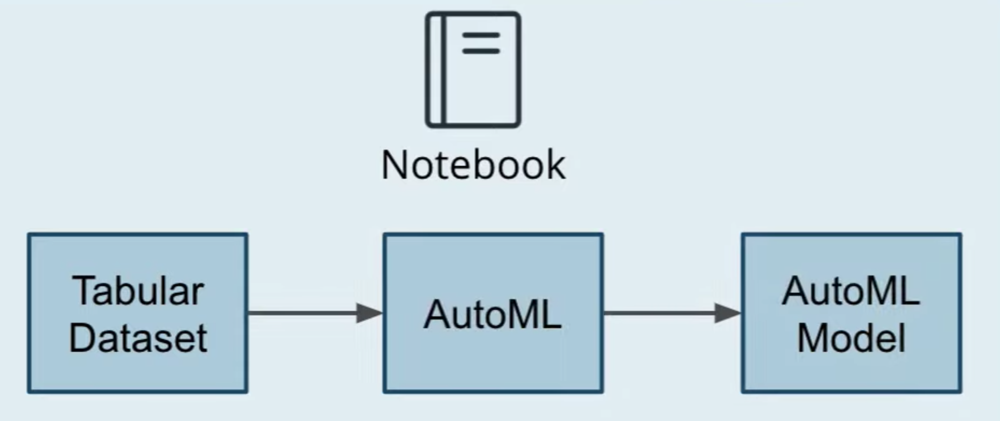
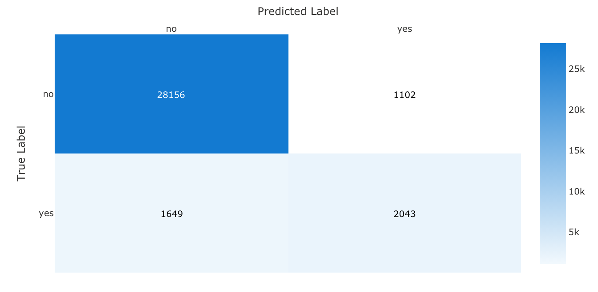
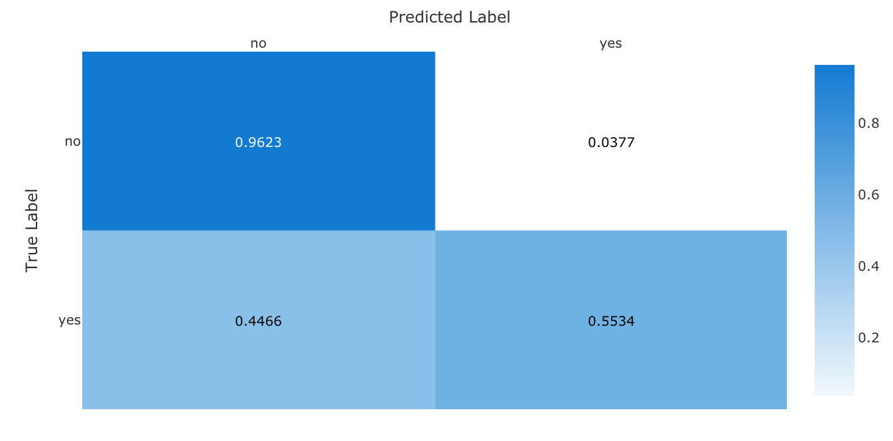
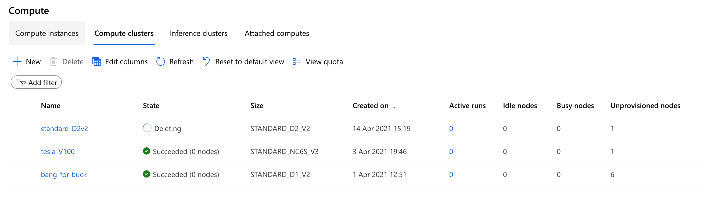

# Optimizing an ML Pipeline in Azure

#### Table of Contents

- [Overview](#1)
- [Summary](#2)
    - [Files Used](#2A)
    - [Dataset](#2B)
- [Part 1: Scikit-learn Pipeline](#3)
    - [Pipeline Architecture](#3A)
    - [Benefits of Parameter Sampler](#3B)
    - [Benefits of Early Stopping Policy](#3C)
    - [Best HyperDrive Model](#3D)
- [Part 2: Automated Machine Learning](#4)
    - [Best AutoML Model](#4A)
    - [Model Explainability](#4B)
- [Pipeline Comparison](#5)
- [Future Work](#6)
- [Cluster Cleanup](#7)

## <a name="1">Overview</a>
In this project, we build and optimize an Azure ML pipeline using the Python SDK and a provided Scikit-learn model. We will be using the HyperDrive for hyperparameter tuning an a custom `scikit-learn` model and AutoML to find an optimal model using both approaches.



## <a name="2">Summary</a>

We will first create a training script `train.py` to run the Scikit-learn logistic regression model, and then build a pipeline to optimize the hyperparameters through HyperDrive using a Jupyter Notebook `project.ipynb`. We will then create an automated machine learning pipeline using Azure AutoML.

Both models' best runs will then be compared with a report of the findings in this README file.


Therefore, this is a binary classification problem where the goal is to train a model to predict the outcome of whether a client will subscribe to a term deposit, based on a variety of predictor variables. Since the outcome is known, this is a supervised learning problem.


### <a name="2A">Files Used</a> 
- `train.py`
- `project.ipynb`

###  <a name="2B">Dataset</a>
The `bankmarketing_train.csv` dataset from the [UCI Machine Learning Repository](https://archive.ics.uci.edu/ml/datasets/Bank+Marketing) is related with the directing marketing campaigns of a Portuguese banking institution. The data collection for these marketing campaigns were based on phone calls and often, more than one contact to the same client was required, in order to assess if the product (bank term deposit) would be (`'yes'`) or (`'no'`) subscribed.

1. `age` - age of the client (numeric)
2. `job` - type of job (categorical: 'admin.','blue-collar','entrepreneur','housemaid','management','retired','self-employed','services','student','technician','unemployed','unknown')
3. `marital` - marital status (categorical)
4. `education` - (categorical: 'basic.4y','basic.6y','basic.9y','high.school','illiterate','professional.course','university.degree','unknown')
5. `default` - has credit in default? (categorical: 'no','yes','unknown')
6. `housing` - has housing loan? (categorical: 'no','yes','unknown')
7. `loan` - has personal loan? (categorical: 'no','yes','unknown') 
8. `contact` - contact communication type (categorical: 'cellular','telephone')
9. `month` - last contact month of year (categorical: 'jan', 'feb', 'mar', ..., 'nov', 'dec')
10. `day_of_week` - last contact day of the week (categorical: 'mon','tue','wed','thu','fri')
11. `duration` - last contact duration, in seconds (numeric). Important note: this attribute highly affects the output target (e.g., if duration=0 then y='no'). Yet, the duration is not known before a call is performed. Also, after the end of the call y is obviously known. Thus, this input should only be included for benchmark purposes and should be discarded if the intention is to have a realistic predictive model.
12. `campaign` - number of contacts performed during this campaign and for this client (numeric, includes last contact)
13. `pdays` - number of days that passed by after the client was last contacted from a previous campaign (numeric; 999 means client was not previously contacted)
14. `previous` - number of contacts performed before this campaign and for this client (numeric)
15. `poutcome` - outcome of the previous marketing campaign (categorical: 'failure','nonexistent','success') # social and economic context attributes
16. `emp.var.rate` - employment variation rate - quarterly indicator (numeric)
17. `cons.price.idx` - consumer price index - monthly indicator (numeric)
18. `cons.conf.idx` - consumer confidence index - monthly indicator (numeric)
19. `euribor3m` - euribor 3 month rate - daily indicator (numeric)
20. `nr.employed` - number of employees - quarterly indicator (numeric)
21. `y` - has the client subscribed a term deposit? (binary: 'yes', 'no')

## <a name="3">Part 1: Scikit-learn Pipeline</a>



### <a name="3A">Pipeline Architecture</a>

#### Hyperparameters
The hyperparameters that will be used for this model are:
1. `--C` - Inverse of the regularization strength where smaller values lead to higher regularization strength
2. `--max_iter` - Maximum number of iterations to converge

#### Classification Algorithm
We will be using logistic regression from the Scikit-learn library as a classification model to predict if a customer will subscribe to a term deposit product at a Portuguese bank given a set of features.

### <a name="3B">Benefits of Parameter Sampler</a>

We have used the [`RandomParameterSampler`](https://docs.microsoft.com/en-us/python/api/azureml-train-core/azureml.train.hyperdrive.randomparametersampling?view=azure-ml-py) where random sampling is performed over a hyperparameter search space. The benefits of it include the possibility of hyperparameter values been chosen from a set of discrete values or a distribution over a continuous range.

**What are the benefits of the early stopping policy you chose?**
### <a name="3C">Benefits of Early Stopping Policy</a>

An early stopping policy is implemented to prevent experiments from running a long time and using up resources. It reduces waste in overrunning costs, thereby improving computational efficiency.

We use a Bandit policy for this project, which is based on the slack factor/slack amount and evaluation interval. The This policy ends the runs when the primary metric is not within the specified slack factor/slack amount of the most successful run.


### <a name="3D">Best HyperDrive model</a>




The best HyperDrive model was in **run 45** (`HD_f61658f7-878f-4035-a75f-340d535df6a8_18`) with the regularization strength `--C` set at `0.7915878841049379` and maximum iterations `--max_iter` set at `50`.


## <a name="4">Part 2: AutoML</a>



In this next part of the project, we will use Azure's AutoML to run an automated machine learning experiment to find the best model using accuracy as a primary metric. Unlike in part 1, where the focus is on solely on hyperparameter tuning the same type of machine learning model (logistic regression), automated machine learning will attempt to use several different types of machine learning models as well as ensemble methods to find the optimal model.

### <a name="4A">Best AutoML model</a>

A total of 20 runs were performed in this AutoML experiment with **Run 18** (`AutoML_fffd8b83-2cdb-411b-834b-230936d70213_18`) found to give the best model over 20 iterations using the [`VotingEnsemble`](https://docs.microsoft.com/en-us/python/api/azureml-train-automl-runtime/azureml.train.automl.runtime.ensemble.votingensemble?view=azure-ml-py) method. This model also achieved an impressive AUC score of `94.6%`.


#### Confusion Matrix



### <a name="4B">Model Explainability</a>


The top 10 features have been identified with the `duration` and `emp.var.rate` as leading features followed by `nr_employed`.

## <a name="1">Pipeline comparison</a>


### Accuracy Differences

Using HyperDrive for automated hyperparameter tuning, an accuracy of `90.82%` was achieved on **Run 45** (`HD_f61658f7-878f-4035-a75f-340d535df6a8_18`). Using AutoML for Azure's automated machine learning, an accuracy of `91.70%` was achieved on **Run 18** (`AutoML_fffd8b83-2cdb-411b-834b-230936d70213_18`). This was despite a higher a number of iterations using HyperDrive (more than twice the number of iterations over AutoML). While AutoML did perform better than the Hyperdrive, this was not a significant improvement at less than 1%

### Architectural Differences

While HyperDrive was only focused on finding the most ideal hyperparameters for logistic regression, AutoML utilized many different types of machine learning models, including ensembled methods to find the optimal model. This would be the equivalent of creating a new pipeline for each HyperDrive model and would therefore use far more resources. As seen in the comparison, the AutoML model managed to successfully beat the HyperDrive model despite having less than half as many iterations.

## <a name="6">Future work</a>
**What are some areas of improvement for future experiments? Why might these improvements help the model?**

### HyperDrive Model

Instead of random parameter sampling, Bayesian sampling can be used instead. Better feature engineering can also be utilized with ordinal instead of one-hot encoding for features such as 'education`. 

### AutoML Model

There is a clear class imbalance with 3,692 positive classes and 29,258 negative classes and addressing this will reduce the model bias. As seen in the confusion matrix and despite the impressive AUC and accuracy score, almost half of the positive classes were wrongly classified.

## <a name="7">Clean Up</a>



In order to prevent compute clusters charges from running, the following command is executed at the end of the notebook.

```
print(f'Deleting {compute_cluster} compute cluster...')
cluster_compute.delete()
print(f'{compute_cluster} deleted')
```
