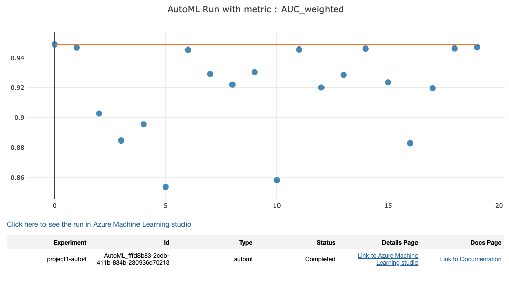
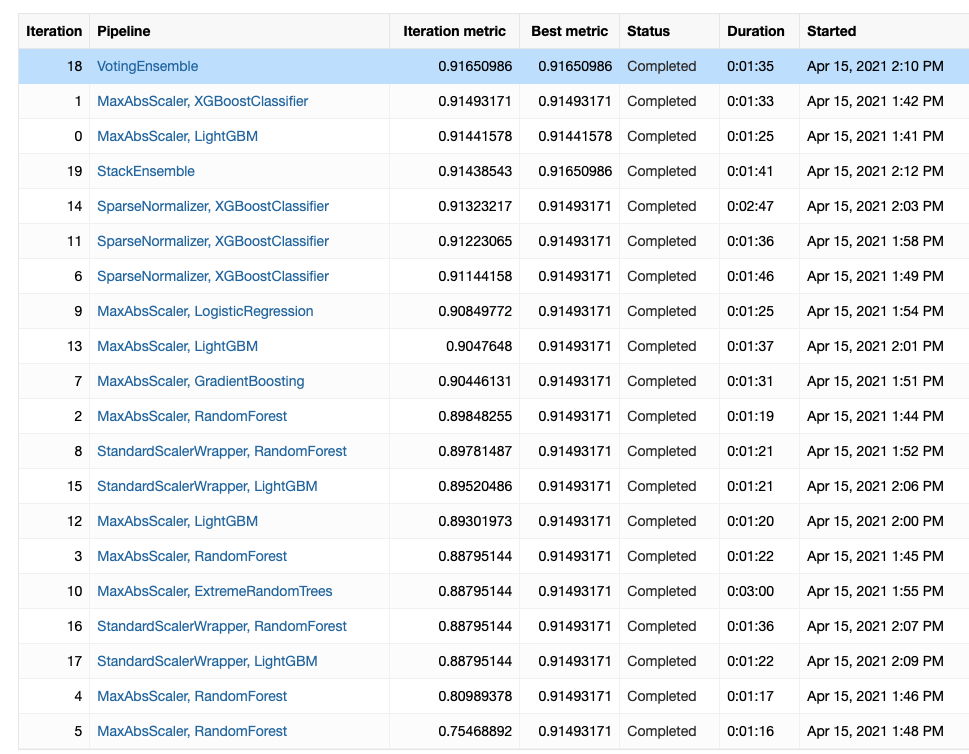
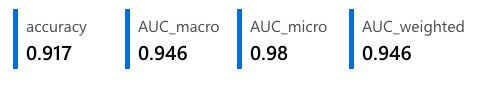
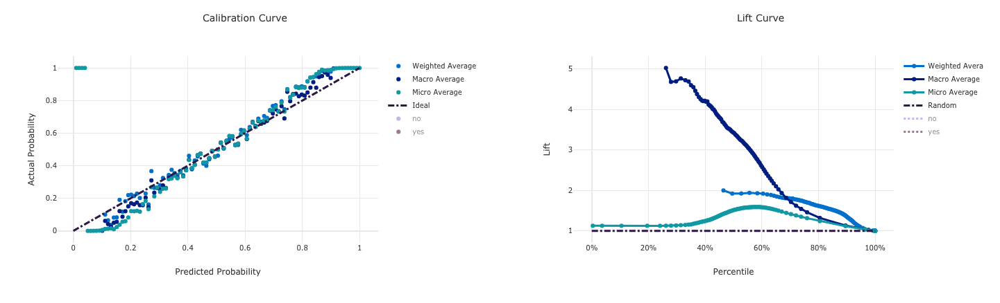
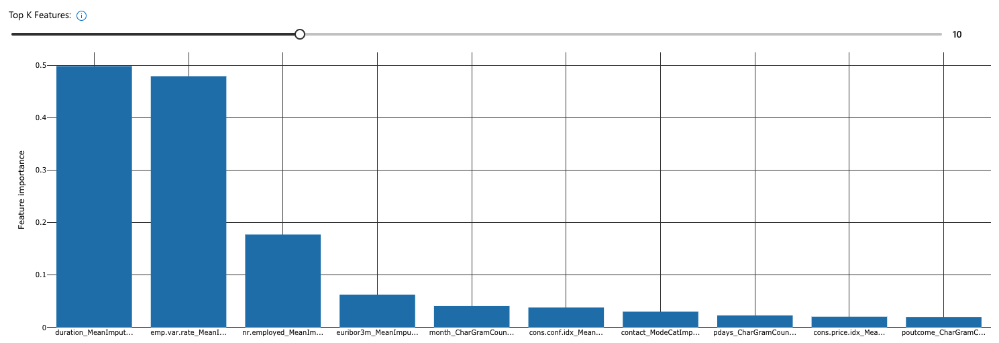

# Optimizing an ML Pipeline in Azure

#### Table of Contents

1. [Overview](#1)
1. [Summary](#2)
    1. Files Used
1. [Scikit-learn Pipeline](#3)
    1. Pipeline Architecture
    1. Benefits of Parameter Sampler
    1. Benefits of Early Stopping Policy
    1. Best HyperDrive Model
1. [AutoML](#4)
    1. Best AutoML Model
1. [Pipeline Comparison](#5)
1. [Future Work](#6)
1. [Proof of Cluster Cleanup](#7)

## <a name="1">Overview</a>
In this project, we build and optimize an Azure ML pipeline using the Python SDK and a provided Scikit-learn model as illustrated in the following: 


## <a name="2">Summary</a>
We will first create a training script `train.py` to run the Scikit-learn logistic regression model, and then build a pipeline to optimize the hyperparameters through HyperDrive using a Jupyter Notebook `project.ipynb`. We will then create an automated machine learning pipeline using Azure AutoML.

Both models' best runs will then be compared with a report of the findings in this README file.

Therefore, this is a binary classification problem where the goal is to train a model to predict the outcome of whether a client will subscribe to a term deposit, based on a variety of predictor variables. Since the outcome is known, this is a supervised learning problem.

### Files Used 
- train.py
- project.ipynb

## <a name="3">Scikit-learn Pipeline</a>

### Pipeline Architecture

#### Data
The `bankmarketing_train.csv` dataset from the [UCI Machine Learning Repository](https://archive.ics.uci.edu/ml/datasets/Bank+Marketing) is related with the directing marketing campaigns of a Portuguese banking institution. The data collection for these marketing campaigns were based on phone calls and often, more than one contact to the same client was required, in order to assess if the product (bank term deposit) would be ('yes') or ('no') subscribed.

1. `age` - age of the client (numeric)
2. `job` - type of job (categorical: 'admin.','blue-collar','entrepreneur','housemaid','management','retired','self-employed','services','student','technician','unemployed','unknown')
3. `marital` - marital status (categorical)
4. `education` - (categorical: 'basic.4y','basic.6y','basic.9y','high.school','illiterate','professional.course','university.degree','unknown')
5. `default` - has credit in default? (categorical: 'no','yes','unknown')
6. `housing` - has housing loan? (categorical: 'no','yes','unknown')
7. `loan` - has personal loan? (categorical: 'no','yes','unknown') 
8. `contact` - contact communication type (categorical: 'cellular','telephone')
9. `month` - last contact month of year (categorical: 'jan', 'feb', 'mar', ..., 'nov', 'dec')
10. `day_of_week` - last contact day of the week (categorical: 'mon','tue','wed','thu','fri')
11. `duration` - last contact duration, in seconds (numeric). Important note: this attribute highly affects the output target (e.g., if duration=0 then y='no'). Yet, the duration is not known before a call is performed. Also, after the end of the call y is obviously known. Thus, this input should only be included for benchmark purposes and should be discarded if the intention is to have a realistic predictive model.
12. `campaign` - number of contacts performed during this campaign and for this client (numeric, includes last contact)
13. `pdays` - number of days that passed by after the client was last contacted from a previous campaign (numeric; 999 means client was not previously contacted)
14. `previous` - number of contacts performed before this campaign and for this client (numeric)
15. `poutcome` - outcome of the previous marketing campaign (categorical: 'failure','nonexistent','success') # social and economic context attributes
16. `emp.var.rate` - employment variation rate - quarterly indicator (numeric)
17. `cons.price.idx` - consumer price index - monthly indicator (numeric)
18. `cons.conf.idx` - consumer confidence index - monthly indicator (numeric)
19. `euribor3m` - euribor 3 month rate - daily indicator (numeric)
20. `nr.employed` - number of employees - quarterly indicator (numeric)
21. `y` - has the client subscribed a term deposit? (binary: 'yes', 'no')

#### Hyperparameters
The hyperparameters that will be used for this model are:
1. `--C` - Inverse of the regularization strength where smaller values lead to higher regularization strength
2. `--max_iter` - Maximum number of iterations to converge

#### Classification Algorithm
We will be using logistic regression from the Scikit-learn library as a classification model to predict if a customer will subscribe to a term deposit product at a Portuguese bank given a set of features.

### Benefits of Parameter Sampler

We have used the Random Parameter sampler where random sampling is performed over a hyperparameter search space. The benefits of it include the possibility of hyperparameter values been chosen from a set of discrete values or a distribution over a continuous range.

**What are the benefits of the early stopping policy you chose?**
### Benefits of Early Stopping Policy

An early stopping policy is implemented to prevent experiments from running a long time and using up resources. It reduces waste in overrunning costs, thereby improving computational efficiency.

We use a Bandit policy for this project, which is based on the slack factor/slack amount and evaluation interval. The This policy ends the runs when the primary metric is not within the specified slack factor/slack amount of the most successful run.


### Best HyperDrive model


## <a name="4">AutoML</a>

A total of 20 runs were performed in this AutoML experiment. 




### Best AutoML model






### Model Explainability



## <a name="1">Pipeline comparison</a>
**Compare the two models and their performance. What are the differences in accuracy? In architecture? If there was a difference, why do you think there was one?**

## <a name="6">Future work</a>
**What are some areas of improvement for future experiments? Why might these improvements help the model?**


## <a name="7">Proof of cluster clean up</a>


```

```
